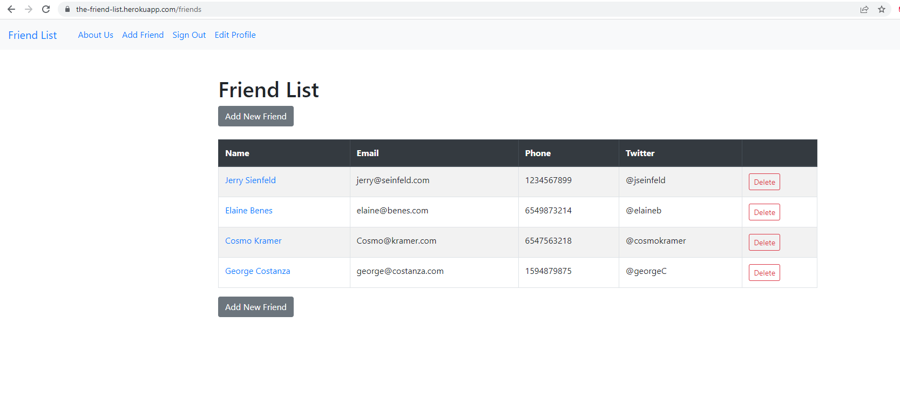

# Friends List - A Ruby On Rails MVC CRUD app with authentication utilizing PostgreSQL and hosted on Heroku

Hosted on: https://the-friend-list.herokuapp.com/

For this app I mostly followed a great tutorial by John Elder at https://www.youtube.com/watch?v=fmyvWz5TUWg. The initial focus is on installing the Ruby environment and then setting up a Ruby on Rails MVC app that uses a database. The tutorial goes into the MVC components and shows how they are used in Ruby on Rails as well as different databases (ex: sqlite for development, postgresql for production). Devise is used for authentication so that each user can have access to only the associated friends list. 

#

Click to enlarge

#

**Process to create this project:**
* Install latest LTS version of Node.js
* Install Yarn
* Install Git-Bash
* Install Sublime Text Editor
* Install Windows Ruby 2.3 (railsinstaller.org - even though ruby is outdated - installs dependencies)
* Install Ruby (rubyinstaller.org) (upgrades from ruby to 3+ from rails installer)

* gitbash (ex: ruby -v) will show updated versions, however, rails will not be found
* In gitbash type: gem install rails (this updates rails) (everything in ruby is gem based. It is a package (similar to pip in python)

* mkdir /c/railsfriends (creates new dir)

* rails new friends (creates new project)
* ls (should show friends directory)
* cd friends/ (should now show 'main' or 'master'
* Open up Sublime text editor
* Go to Project
* Go to Add Folder To Project
* Select c:/railsfriends/friends

* In Gitbash type: rails s (s stands for server)
* Go to http://localhost:3000/
* In another gitbash terminal : rails generate controller home index (or: rails g)

note: ex: create link: <%=link_to 'Friend List', root_path, class:"navbar-brand" %> config/routes.rb  root 'home#index'
friends/app/controllers - def index end

note: rails routes (shows all the routes in the app)

**CREATE DB:**
* rails g scaffold friends first_name:string last_name:string email:string phone:string twitter:string (generates a scaffold/database table)
* rails db:migrate (creates schema - creates db from migration)

**Install Gems or Gem Devise** 
* To install gem:add line to gem file
* Terminal: bundle install

* but...For Devise it's a little more complicated (instructions on homepage/github):

* add to gem file
* bundle install (installs items in gem file - much like requirements.txt in python)
* rails generate devise:install (follow instructions -ex: copy items to file, 
* rails g devise:views,
* rails generate devise user (creates db for user authentication info), 
* rails db:migrate  (creates schema - creates db from migration)

https://github.com/heartcombo/devise
https://rubygems.org/gems/devise

**Add authentication links to app/views/home/_header.html.erb**
		* add conditional depending on if signed in: <% if user_signed_in? %>

* if sign out isn't working: change 'config/initializers/devise.rb' the line config.sign_out_via = :delete to config.sign_out_via = :get, but don't change the link_to ... method: :delete

**Rails associations**
**Associate a user table with a specific friends list**
https://guides.rubyonrails.org/association_basics.html

	*In app/models/friend.rb add:
		belongs_to :user
		inside class Friend

	*In app/models/user.rb add:
		has_many :friends
		to class User

	*In Bash type: rails generate migration add_user_id_to_friends user_id:integer:index (this creates the relationship between friends and user)

	*rails db:migrate

	* Add a hidden field to the new friend page to associate that friend with the current user upon creation:

	<%= form.number_field :user_id, id: :friend_user_id, value:current_user.id, type: :hidden %>

	* Must also update app/controllers/friends_controller.rb in put parameter to now accept user_id on the creation of a new friend. Change
	 def friend_params  
	 	params.require(:friend).permit(:first_name, :last_name, :email, :phone, :twitter)
	 to
      params.require(:friend).permit(:first_name, :last_name, :email, :phone, :twitter, :user_id)

     *In app/controllers/friends_controller.rb add:
     	before_action :authenticate_user!, except: [:index, :show]
     	before_action runs before any other methods in the controller. 
     	This code means that if a user is not authenticated -- don't allow anything except to see the index page and show page. 

     *In app/controllers/friends_controller.rb add:
       before_action :correct_user, only: [:edit, :update, :destroy]
       		(make sure it is the correct user only for edit, update, destroy)

       and add def correct_user

        def correct_user
	    	@friend = current_user.friends.find_by(id: params[:id])
	    	redirect_to friends_path, notice: "Not Authorized to Edit This Friend" if @friend.nil?
	  	end
	  		(i.e. the correct_user is the current_user who's been associated with the id. If the correct_user is not correct -- send error message)

	  	and change def new line

	  	def new
    		# @friend = Friend.new
    		@friend = current_user.friends.build
    	end
    		(don't want Friend.new we want the current user to be associated)

		and change def create line
		
		def create
		    # @friend = Friend.new(friend_params)
		    @friend = current_user.friends.build(friend_params)

		*The above association code makes it so everyone can see all of the friends, but only the authorized user can edit/delete the associated friends. 

		If want to only show associated friends  add
			<% if friend.user == current_user %>
			<% end %> 
			to app/view/friends/index.html.erb

**Change friends page to the home page**
	* To change friends page to home page in friends/config/routes.rb
		change   root 'home#index'  to  root 'friends#index'
	* Create <% if user_signed_in? %> <% else %> <% end %> in app/views/friends/index.html.erb

	*Notes: when pulling from the database, you are dealing with @friends the whole db (ex: have to loop through on index page. ). On edit page we are pulling just one friend but labeling it @friend 

**Note on Controllers**
	def about
		@about_me = "My name is d"  
		@answer = 2+2
	end

	Anything you want to pass into the view (api from another website, get request, instance variable) can be done through the controller. The instance variable @about_me will be accessible to the view. Instance variables have @ in front (@about_me) whereas (about_me) is just a local variable

	Access the variable in the About view --> 
 <%= @answer %> 

**Setting up Heroku Hosting**
 	*in Gemfile move: gem "sqlite3", "~> 1.4" to group :development do
 	*in Gemfile add:
 		*group :production do
  		*gem 'pg', '~> 1.4', '>= 1.4.1'
 		*end

 	*bundle install --without production

	*Sign up for a Heroku account
	* Integrate github with heroku
		* https://devcenter.heroku.com/articles/github-integration
	* Create Procfile (this automatically creates migration with each deployment) and add line:
		* release: rake db:migrate